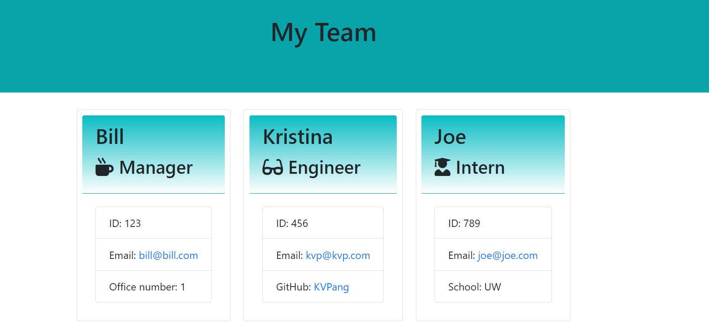

# Team Profile Generator

## Table of Contents 
  - [Description](#description)
  - [User Story](#user-story)
  - [Installation](#installation)
  - [Mock-Ups](#mock-ups)
  - [Links](#links)
  - [Tests](#tests)
  - [License](#license)

## Description 
This application allows user to generate a team - Manager(s), Engineer(s) and Intern(s) based on a brief series of questions that can be answered within the terminal. 

## User Story
```
AS A manager
I WANT to generate a webpage that displays my team's basic info
SO THAT I have quick access to their emails and GitHub profiles
```

## Installation
1. Clone repository
2. Install Node.js - required for running the application
3. Enter ``npm install`` in the terminal

## Mock-Ups



## Links
- GitHub: https://github.com/KVPang/team-profile-generator
- Walkthrough Video: 

## Tests
Enter ``npm run test`` in the terminal 

## License
MIT